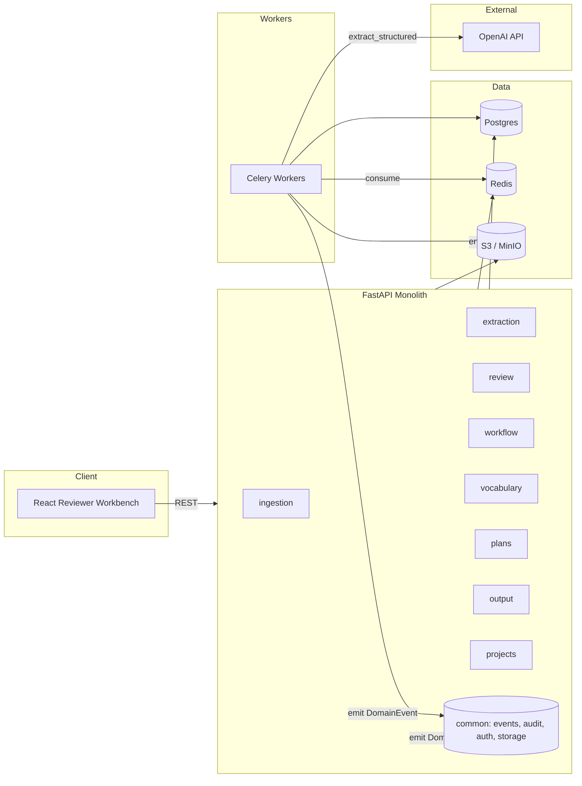
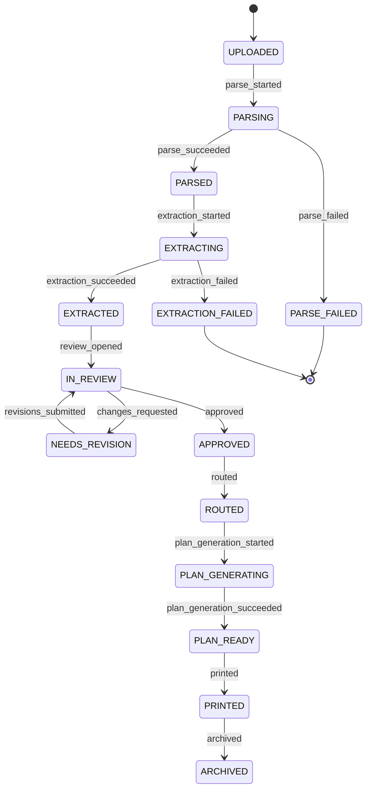

# Architecture

One-page system overview. For deeper rationale, see [ADRs](./adr/). For data, see [data-model.md](./data-model.md).

## System diagram



## Module map

The monolith has nine domain modules and one cross-cutting `common` package. Boundaries are enforced by `import-linter` (see `pyproject.toml`).

| Module | Responsibility | Owns |
|---|---|---|
| `app.projects` | Tenancy: org, project, user, membership | tenant primitives |
| `app.ingestion` | Upload, validate, parse PDF, persist pages | `Document`, `DocumentPage` |
| `app.extraction` | LLM-driven structured extraction with citations | `Extraction`, `ExtractionField`, `Citation` |
| `app.review` | Human-in-the-loop edits and approvals | `ReviewSession`, `ReviewRevision` |
| `app.workflow` | Document lifecycle state machine | `WorkflowTransition` |
| `app.vocabulary` | Controlled vocabularies, versioned | `Vocabulary`, `VocabularyVersion`, `VocabularyTerm` |
| `app.plans` | AI-assisted downstream plan generation | `Plan` |
| `app.output` | Printing / labeling adapters | `PrintJob` |
| `app.common` | Events, audit, auth, storage, telemetry | none — leaf only |

Rule: domain modules do not import each other directly. They communicate through `app.common.events.EventBus` (in-proc pub/sub today, queue-backed later). The `workflow` module is the one exception — it is the spine and is invoked from API handlers in other modules.

## Document lifecycle state machine



Every transition:
1. Requires a role-guard (`Reviewer`, `Approver`, `System`).
2. Emits a typed `DomainEvent` on `EventBus`.
3. Writes a row to `workflow_transitions` (append-only).
4. Is covered by a unit test in `tests/test_state_machine.py`.

## Request shape — the vertical slice

```
1. POST /documents                        →  state: UPLOADED
2. Celery: parse_document.delay(doc_id)   →  state: PARSING → PARSED
3. Celery: run_extraction.delay(...)      →  state: EXTRACTING → EXTRACTED → IN_REVIEW
4. GET /review/queue                      →  reviewer sees doc
5. GET /review/{doc_id}                   →  PDF + fields + citations
6. PATCH /review/{doc_id}/fields/{path}   →  creates review_revision row
7. POST /review/{doc_id}/approve          →  state: APPROVED → ROUTED
                                          →  DomainEvent: DocumentApproved
                                          →  output module logs "would print"
```

## Cross-cutting concerns

| Concern | Where it lives |
|---|---|
| AuthN | `app/common/auth.py` (JWT, swappable for OIDC) |
| AuthZ | role guards in `app/workflow/transitions.py` + FastAPI dependency in `app/common/auth.py` |
| Audit | `app/common/audit.py` writes append-only rows; subscribes to `EventBus` |
| Observability | `app/common/telemetry.py` (structlog + OTel hooks) |
| Storage | `app/common/storage.py` (S3-compatible) |
| Background work | Celery; tasks defined in `app/extraction/tasks.py` and `app/ingestion/tasks.py` |
| Events | `app/common/events.py` — in-proc pub/sub today, swap to Redis Streams later |
