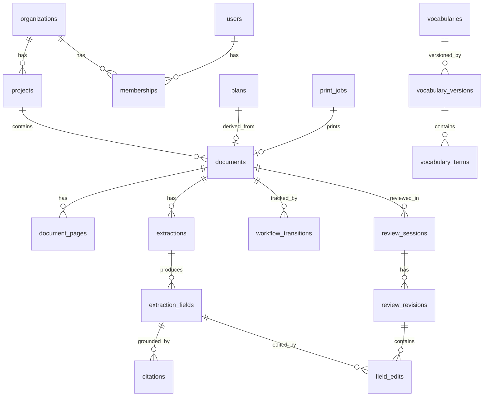

# Data Model

Multi-tenant Postgres schema. All `app.*` ORM models are in `app/<module>/models.py`. The full DDL lives in `alembic/versions/0001_initial.py`.

## ER diagram

## Entities

### Tenancy

- **organizations** — tenant root.
- **projects** — a construction project (e.g., "Acme Tower"). FK to organization.
- **users** — auth principals.
- **memberships** — `(user, organization, project, role)`. Role ∈ {`admin`, `reviewer`, `approver`, `uploader`, `viewer`}.

### Documents

- **documents** — `id`, `project_id`, `uploader_user_id`, `kind` (`submittal | rfi | spec | drawing | contract`), `storage_key` (S3), `original_filename`, `current_state` (denormalized for query — always equal to last transition's `to_state`), `created_at`.
- **document_pages** — one row per page. Holds parsed text and a JSON map of token bboxes used for citation grounding. `(document_id, page_number)` unique.

### Extraction

- **extractions** — versioned. `id`, `document_id`, `schema_id`, `schema_version`, `prompt_version`, `model`, `model_version`, `raw_response` (JSONB, the verbatim LLM output), `created_at`. Append-only.
- **extraction_fields** — `id`, `extraction_id`, `field_path` (JSON pointer, e.g., `/manufacturer`), `value` (JSONB), `confidence` (float). Append-only.
- **citations** — `id`, `extraction_field_id`, `page`, `bbox` (`[x0, y0, x1, y1]`), `source_text`. **At least one citation per extraction_field is enforced at the service layer**; the FK to field is `NOT NULL`.

### Review

- **review_sessions** — `id`, `document_id`, `opened_by_user_id`, `opened_at`, `closed_at`, `outcome` (`approved | rejected | needs_revision | null`).
- **review_revisions** — `id`, `review_session_id`, `parent_revision_id` (self-FK), `created_at`. The session can have many revisions if the reviewer iterates.
- **field_edits** — `id`, `review_revision_id`, `extraction_field_id`, `previous_value`, `new_value`, `reason`. Append-only.

### Workflow

- **workflow_transitions** — `id`, `document_id`, `from_state`, `to_state`, `actor_user_id` (null when System), `event_name`, `event_payload` (JSONB), `created_at`. Append-only. **The source of truth for "what happened."**

### Vocabulary

- **vocabularies** — `id`, `slug` (`csi_masterformat`), `display_name`.
- **vocabulary_versions** — `id`, `vocabulary_id`, `version_label` (e.g., `2020-rev1`), `published_at`. Immutable.
- **vocabulary_terms** — `id`, `vocabulary_version_id`, `code` (`09 30 00`), `label` (`Tiling`), `parent_term_id` (self-FK for hierarchy). Immutable.

When extraction binds a value to a vocab term, it stores `(term_id, version_id)`.

### Plans & Output

- **plans** — `id`, `document_id`, `kind` (`transmittal | submittal_package`), `status`, `storage_key`. Stub for slice.
- **print_jobs** — `id`, `document_id` or `plan_id`, `adapter` (`pdf_transmittal | label_zpl`), `status`, `result_storage_key`.

### Audit / events

- **audit_log** — `id`, `event_name`, `payload`, `actor_user_id`, `created_at`. Subscribed via `EventBus`. **Append-only, never updated.** Long-term, this is the analytics source — the OLTP tables are derived from it conceptually.

## Why this shape

- **Append-only where it matters.** `extractions`, `extraction_fields`, `citations`, `review_revisions`, `field_edits`, `workflow_transitions`, `audit_log` are all append-only. Mutations happen on a thin "current state" projection (`documents.current_state`, `review_sessions.outcome`) which is derivable from the append-only sources.
- **Citations are FK-enforced, not advisory.** A field without a citation is a schema violation, not a "low confidence" warning.
- **Vocabularies are versioned snapshots.** Historical extractions remain interpretable when codes change.
- **No nullable status enum scattered around.** State lives in `workflow_transitions` (history) and `documents.current_state` (projection of the latest). One way in, one way out.
